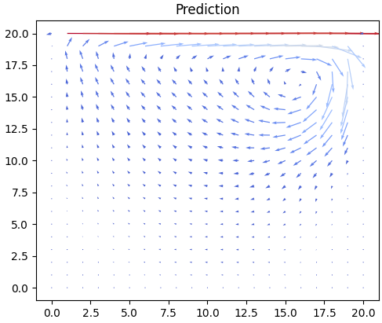
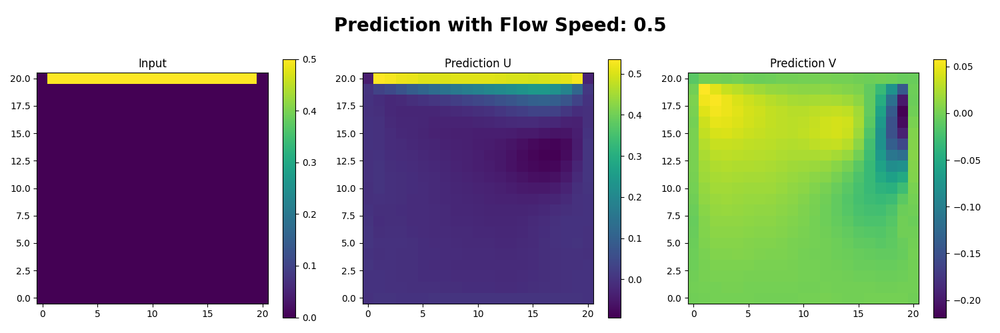

# Fluid Solver

This repository contains a parallel fluid solver written from scratch using navier stokes equations.
It also contains a simple yet configurable CNN to predict the flow of training data generated from the parallel solver.


## Solver

In addition to a compiler and cmake you need `libvtk` to output simulation data which can be viewed with `paraview`.
To build the solver run the following commands:
```bash
mkdir build
cd build
cmake ..
make install
```

Then the program can be run with `mpirun ./numsim_parallel {path to scenario file}`
The output will be in the `out` folder next to the executable.
It contains `vti` files for each timestep which can be opened with paraview.

## Machine Learning

Example prediction:





For the CNN you need to have `pytorch` and `numpy` installed. 

### Data Generation

To generate training data, the solver can be run with a scenario file that specifies the number of samples and ranges to interpolate data.
This could look something like this:
```
generateTrainingData = 1
nSamples = 101
reMin = 500.0
reMax = 1500.0
uMin = 0.5
uMax = 1.5
```
This will generate 101 samples with Reynolds numbers between 500 and 1500 and inflow velocities between 0.5 and 1.5.
The generated data will be stored in the `train` folder next to the executable.

### Training

The model is specified by a `config.json` file which contains parameters for the model architecture and training process.
To invoke training, the command `python fluid_ml/main.py --config {path to config file}` can be used.
There are a few default config files in `cfg/ml`. 
After training, the model will be saved in the `models` folder and a pdf with summary plots will be saved alongside.
The pdf is automatically generated from a jupyter notebook. For this you need to have a LaTeX installation.

The whole Data Generation and Training process can be run with `run_pipeline [-g generation_config] [-t training_config].

## Linting

For the C++ code `run_tidy.sh` and `run_format.sh` can be used to run clang-tidy and clang-format respectively.
For the python code `flake8` and `pylint` are used for linting. Linting can be invoked with `make`. 
For linting, you need to have `flake8`, `wemake-python-styleguide` and `pylint` installed. 
This can be done in a virtual environment with pip.
